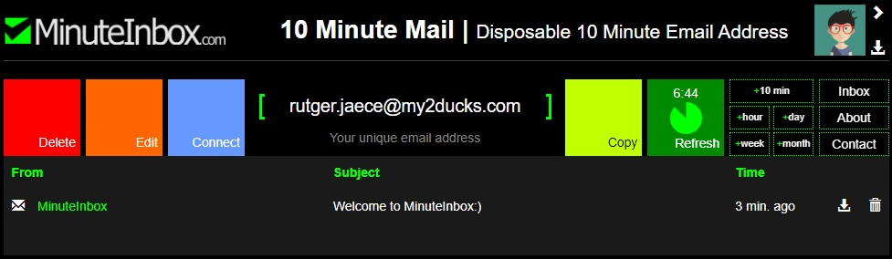

# MinuteInbox.JS

Unofficial javascript wrapper for minuteinbox.com



## 💻 Description

Create temporary e-mails and receive e-mails with MinuteInbox through python! It also parses the E-Mail Address MinuteInbox created for you, so you can directly access last and first name. 🎉

## 🎉 Usage

You'll be able to use this, just as in the following example:

```javascript
const MinuteInbox = require("./index");
const { getContent } = require("./api");

const checkEmails = async (inbox) => {
  console.log("Start checking ...");
  // fetch all emails in the inbox
  for (let mail of await inbox.getMails()) {
    console.log("\tFROM:", mail.sender.name, mail.sender.address);
    console.log("\tSUBJECT:", mail.subject);
    console.log("\tSENT AT:", mail.sent_at);
    console.log("\tIS NEW:", mail.is_new);
    console.log();
    if (mail.is_new) await getContent(address, token, mail.id);
  }

  setTimeout(() => {
    checkEmails(inbox);
  }, 3000);
};

const main = async () => {
  // use without parameters to create a new inbox
  const inbox = await MinuteInbox.build();

  // use with address and token to reuse an existing inbox
  // const inbox = new MinuteInbox(
  //   "crockett.cainen@my2ducks.com",
  //   "66a5c5b8d3384454dd88e381fcbfdfc0"
  // );

  address = inbox.address;
  token = inbox.token;

  console.log(address, "(", token, ")");

  // extend the expiration of the inbox by 10 minutes
  inbox.extend_10m();

  console.log("Expires in:", await inbox.expires_in(), "seconds");

  checkEmails(inbox);
};

main();
```

## ⚠️ Disclaimer

I'm not associated in any way with MinuteInbox.com, if requested by them I will take down this repository. In this case please prove your Identity and send me an E-Mail. You can check my profile to find it.

## 🤝 Support

<div align="center">🎀 Contributions (<a href="https://guides.github.com/introduction/flow" title="GitHub flow">GitHub Flow</a>), 🔥 issues, and 🥮 feature requests are most welcome!</div>

<div align="center">💙 If you like my projects, Give them ⭐ and Share it with friends!</div>

<br/>

<div align="center">
    <a href="https://www.buymeacoffee.com/Tyrese3915" target="_blank">
        
    </a>
    <a href="https://liberapay.com/Tyrese3915" target="_blank">
        
    </a>
    <a href="https://ko-fi.com/Tyrese3915" target="_blank">
        
    </a>
</div>

<br />

---

<div align="center">Made by ❤️ Tyrese</div>

## <div align="center">⚡️<i>Stay awesome!</i>⚡️</div>
